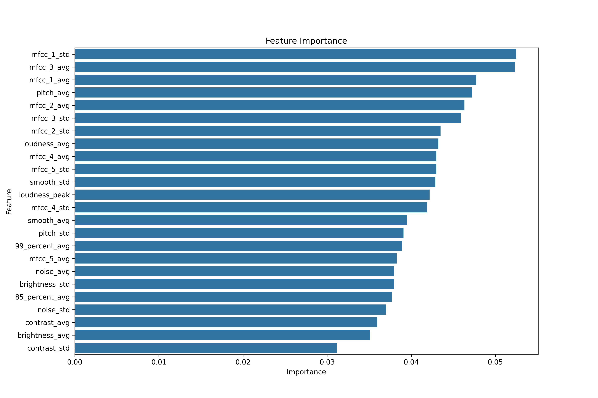

# Environmental Audio Classifier 

The goal of this project is to build an audio classification system from scratch without relying on Deep Learning/Neural Networks. By manually engineering mathematical representations of audio waves (timbre, pitch, and temporal variance), this project explores how traditional Machine Learning algorithms interpret complex, overlapping environmental sounds.

This project uses the ESC-50 Dataset (https://github.com/karolpiczak/ESC-50), a labeled collection of 2,000 environmental audio recordings (5 seconds long, 50 distinct classes). Categories range from animal sounds ("Dog", "Crickets") to mechanical noises ("Chainsaw", "Helicopter").

Audio Processing: Librosa
Data Manipulation: Pandas
Machine Learning: Scikit-learn (Random Forest)
Visualisation: Matplotlib, Seaborn

To capture the uniqueness of each sound, 20+ acoustic features were taken from each file
Spectral: Brightness, Noisiness, Loudness
Timbral: The first 5 MFCCs
Harmonic: Pitch, Contrast
Variance: Mean and STD were calculated for all

Results:
The Random Forest Classifier achieved 50% accuracy.

Feature Importance:

